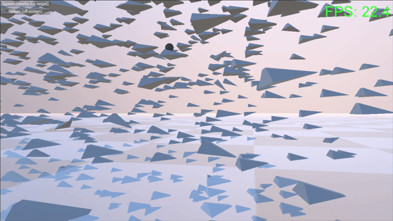

# Boids GameObject to DOTS Porting Study

Unity GameObject 기반 Boids 시뮬레이션을 DOTS/ECS로 포팅하여 성능 비교 및 전환 방법론 연구

<- 게임오브젝트 기반 ->

<- DOTS 기반 ->

## Performance Comparison

| Boid Count | GameObject | DOTS/ECS |
|------------|-----------|----------|
| 500        | 43 FPS    | 390 FPS  |
| 1,000      | 19 FPS    | 340 FPS  |
| 5,000      | <0.5 FPS  | 180 FPS  |

## Features

- **동일 알고리즘 보장**: BoidFlockingMath 공유로 GameObject/DOTS 동일 동작
- **Spatial Hashing**: O(n) 이웃 검색 최적화
- **Burst Compilation**: SIMD 자동 벡터화
- **Job System**: 멀티스레드 병렬 처리

## Environment

- Unity 6.2
- Entities 1.4.3
- URP (Universal Render Pipeline)
- IL2CPP Backend

## Original Project

- Author: Keijiro Takahashi
- License: MIT
- Source: https://github.com/keijiro/Boids
